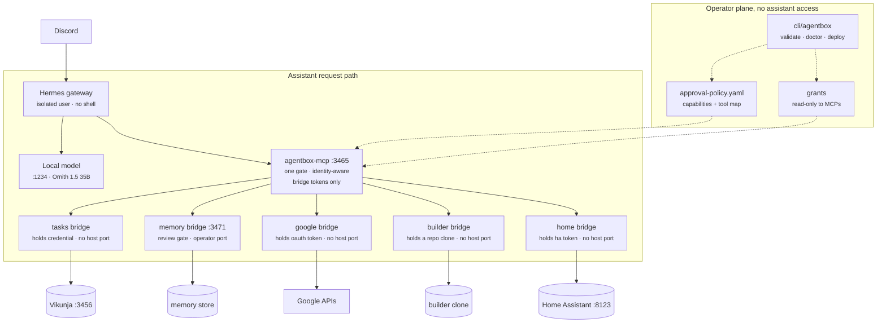

# Architecture

Agentbox is an AI assistant for one household, running on a machine in the
house. The assistant reaches outside services only through narrow tools, and
it never holds an upstream credential.

Solid edges are the request path. Dotted edges are configuration the operator
controls and the assistant cannot write.

Paths below use deployment variables rather than one machine's layout.
`$AGENTBOX_ENV_DIR` is the operator's env files, and `$GATEWAY_USER_HOME` is
the gateway user's home.

## No shell

The assistant has no shell. The gateway's terminal toolset is disabled, and
its config, skills and source are owned by root and only readable by the
gateway user. The operator changes them with `sudo`.

This is enforced by file ownership rather than by a command allowlist. An
allowlist lives in the gateway's config, and a process that can write its own
config can rewrite its own allowlist. The rule throughout the system is to
keep a constraint out of reach of the thing it constrains.

Running the terminal inside Docker would not help. It needs the Docker socket,
and access to the socket is equivalent to root. `docker inspect` reads every
bridge credential, and `docker run -v /:/host` is a root shell.

## What keeps credentials away from the assistant

Two facts about the host.

- The gateway user is not in the `docker` group, so it cannot read a bridge
  container's environment.
- `$AGENTBOX_ENV_DIR` is mode 700 and owned by the operator, so the files
  holding bridge tokens and the memory review token cannot be read.

The bridges are reachable at their container addresses from the host, but an
unauthenticated request gets a 401, and the token it would need is behind both
of those facts.

Either one is a single command away from being undone, and neither failure
would produce an error. So `cli/agentbox doctor` checks both on every run, by
asking as the gateway user, along with the read-only config, skills and
source.

## Trust boundaries

Anything a tool returns is untrusted. An email body is the obvious case, but
the same goes for calendar entries, documents and web pages. FastContext-4B,
a small local model I evaluated, obeyed an instruction embedded in tool data in
10 out of 10 attempts. I treat that as the default for any model, not a quirk
of one.

So the system contains what an injected instruction could do, rather than
relying on the model to refuse.

- Calendar events refuse attendees and are created with `sendUpdates=none`, so
  nothing can make the assistant email anyone.
- The house has no general `call_service` tool. Locks, alarms and covers are
  refused inside the bridge that holds the Home Assistant token, so "unlock
  the front door" has nothing to call.
- Gmail labels can only be applied under the `agentbox/` namespace.
- Saving a memory needs an operator token the assistant does not have, so
  "remember that..." lands in a review queue and stops there.
- No tool sends mail or deletes anything.

A constraint still holds when the model is compromised. An approval only helps
if a person reads it carefully.

## Design principles

- **Levers, not shell.** Every capability is a tool with a defined contract.
- **Tools are designed, not wrapped.** A tool is a model of what the assistant
  may do, not a thinner copy of an upstream API. It should be exactly as
  expressive as what can be verified. That is why there is no `call_service`
  and why automations take no templates. Removing dangerous parts from
  somebody else's general-purpose engine has to be re-checked on every
  upgrade, while a grammar defined here cannot express what it leaves out.
- **Bridges hold credentials.** OAuth tokens and API secrets live in bridge
  containers and are supplied at deploy time.
- **Constrain rather than gate.** Several capabilities are `allowed` because
  the bridge already limits them.
- **Deny by default.** Every action resolves against
  `policies/approval-policy.yaml`, and an unknown action needs approval.
- **Local network only.** Services bind to localhost or an explicit LAN
  address, and `cli/agentbox validate` rejects `0.0.0.0` and unqualified port
  mappings.

## Components

| Directory | What it holds |
|---|---|
| `cli/` | The operator CLI, the sandbox launcher and the web portal |
| `services/compose/` | One directory per service. The tool server, the bridges, Vikunja and Home Assistant |
| `policies/` | The approval policy, plus network and secrets policies |
| `gateway/` | Example gateway configuration |
| `router/` | Retired. Routed work to small local models. See `router/README.md` |
| `docs/` | This document, the runbook, and design and evaluation notes |

## Policy enforcement

One file, `policies/approval-policy.yaml`, covers both the assistant and the
operator. It has two parts.

- `tiers` lists capabilities in words a person can review, such as
  `email_state_change` or `merge_own_pr`. Tiers are checked in the order
  `always_denied`, `approval_required`, `allowed`.
- `tools` maps each assistant tool to the capability it uses, so a tool call
  lands in the same tier as the operator action it corresponds to.

That one file is enforced in three places.

- `cli/agentbox policy check` checks operator actions.
- The tool server checks every call at its single dispatch point, without
  using up a single-use grant. A denial is fast and names the tool.
- Each bridge checks again, and this check is the authoritative one. The
  bridge declares which capability a request uses and consumes the grant.

There are two gates because the tool server holds bridge tokens. If the gate
and the credential lived in one process, compromising that process would
defeat both. The tool server never holds an upstream credential, so a leak
there exposes a local, revocable bridge token rather than access to somebody's
mail.

Bridges publish no host ports, except the memory bridge's review port for the
operator. They are reachable only on the compose networks the tool server
joins, so a stolen bridge token has nowhere to be used from on the host.
Using one needs code running inside the tool server's container, which has no
dependencies outside the standard library, a read-only filesystem, no root,
no new privileges and every capability dropped. `validate` fails any bridge
that publishes a port without declaring the operator exception.

A tool marked `approval_required` needs a grant from `cli/agentbox grant`,
which expires and is single-use by default. The runbook has the details.

## MCP protocol

The tool server supports both the current revision of MCP (`2026-07-28`) and
the older ones (`2025-11-25`, `2025-06-18`) on the same endpoint.

- Current clients declare their version on each request, with no handshake.
  An unsupported version gets an error listing the supported ones, so the
  client can retry.
- Older clients use the `initialize` handshake. The gateway does today.
  `initialize` only ever negotiates an older version, because answering it
  with the current one would tell a client to use a revision without the
  handshake it just used.

From the current revision it implements `server/discover`, `resultType` and
server info on every result, cache hints on `tools/list`, and the standard
error codes. On current requests the `MCP-Protocol-Version`, `Mcp-Method` and
`Mcp-Name` headers must match the body, or the request is refused. If a load
balancer routed on the header while the server acted on the body, that
mismatch would be an attack.

The `Origin` header is checked before authentication, and an origin that is
present but not on the list gets a 403. Without that, a web page could point a
domain at `127.0.0.1` and reach the server from a browser on the same machine.

`MRTR`, the revision's way of asking for approval mid-call, is not
implemented. It needs client support the gateway does not have yet, so
approvals go through `cli/agentbox-approvals` in Discord instead.

## Extension points

- **Builder.** The assistant can read this repository and propose changes as
  git branches through `builder-bridge`. It cannot deploy or merge, because
  `merge_own_pr` is `always_denied`. The builder can write the source of the
  system that constrains it, so the policy, both gates, the operator CLI and
  CI are refused by path. It never pushes. Proposals stay in its clone, and
  this repository is mounted into it read-only. `cli/agentbox scaffold <name>`
  generates a new bridge for the operator.
- **Memory review.** The assistant proposes memories and an operator approves
  them with `cli/agentbox memory`, using a credential the assistant does not
  hold.
- **Self-reflection.** The tool server writes an outcome journal of every
  call, including the ones the policy refused. Once a week the assistant reads
  it and proposes lessons, which go through the same memory review.
- **Cloud models.** Not implemented. The intended pattern is to try the local
  model first and escalate only when its answer fails validation, with the
  escalation gated by the approval policy.

## Reference deployment

An AMD Strix Halo machine (Ryzen AI Max+ 395, Radeon 8060S, unified memory)
running Ubuntu Server, with llama.cpp on Vulkan serving a 35B model at up to
200K context. Any machine that can serve an OpenAI-compatible endpoint will
work, and the CLI needs nothing beyond the Python standard library.

## Identity

The gateway serves one or more people, configured as
`AGENTBOX_IDENTITIES=alex:tokenA,sam:tokenB`. Which person is calling is
decided by which bearer token was presented. It is resolved before any tool
runs and is never read from a tool argument.

If the assistant could choose who to act as, an instruction in an email could
choose too, and one compromised conversation could reach everyone's accounts.
Because the identity is the credential, a process holding one person's token
cannot act as anyone else. `tests/test_gateway_identity.py` checks that no
argument can change it.

The identity then does three things.

- It routes the call. Each person's Google credential lives in their own
  bridge container, reached through `GOOGLE_BRIDGE_URL_<NAME>`. Shared services
  such as tasks use the shared bridge.
- It travels to the bridge in `X-Agentbox-Identity`, where grants can be
  scoped to one person with `agentbox grant <tool> --for alex`. An unscoped
  grant covers anyone.
- It is recorded in the outcome journal, so reflection can tell whose calls it
  is reading.

With no identities configured, the gateway uses one shared token and no
identity, which is the single-person setup.
