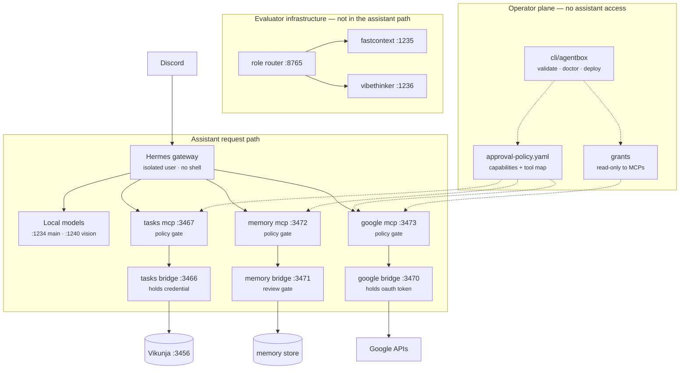

# Architecture

Agentbox is a self-hosted personal AI assistant platform for a single
operator on local hardware. The assistant (a Hermes-style gateway) never gets
raw shell access or raw credentials — it gets narrow, policy-gated levers.

Solid edges are the live request path. Dotted edges are configuration the
operator controls and the assistant cannot write. The role router and both
worker models are drawn separately because the gateway does not call them —
they serve the evaluator. Verified against the live gateway config and the
router's access log, 2026-08-02.

## Trust boundaries

**Tool results are untrusted input.** Anything a bridge returns may contain
text an outsider wrote — an email body is the obvious case. A small worker
model on this host (FastContext-4B, `:1235`) was measured obeying an
instruction embedded in tool data in 10 of 10 attempts on a memory-reconcile
task (n=10, single task type, measured in `agentbox-evals`). Treat that as the
default assumption for any model in the loop, not a quirk of one worker.

The practical consequence: **do not wire `/context/extract` into the assistant's
path for content that originated outside the account** without deciding what
happens when the extraction obeys the content instead of summarising it. Today
that path does not exist, which is the only reason this is a note rather than a
defect.

Where this is already contained, and why those choices were containment rather
than gating:

- calendar events refuse `attendees` and send `sendUpdates=none`, so an
  injected instruction cannot make the assistant email anyone;
- Gmail labels can only be applied from the `agentbox/` namespace, so an
  injected label id is refused;
- durable memory needs an operator token the assistant does not hold, so an
  injected "remember that…" reaches a review queue and stops;
- no tool sends mail or deletes anything, because those are not exposed.

A constraint holds when the model is compromised. An approval only helps if a
human reads carefully first.

## Design principles

- **Levers, not shell.** Every capability is an explicit endpoint with a
  contract, not terminal access.
- **Bridges hold credentials.** OAuth tokens and API secrets live inside
  bridge containers, injected at deploy time (1Password `op://` references or
  plain env files). The assistant and router never see them.
- **Deterministic routing.** Which worker handles which role is code
  (`router/agentbox_router.py`), not model judgment. Used by the evaluator.
- **Constrain rather than gate, where possible.** A constraint holds when the
  model is compromised; an approval only helps if a human reads carefully
  first. Several capabilities are `allowed` because the bridge contains them.
- **Deny by default.** Actions resolve against `policies/approval-policy.yaml`
  in tier order `always_denied` → `approval_required` → `allowed`; unknown
  actions require approval.
- **Local-only network posture.** Compose services bind to localhost or an
  explicit LAN IP; `cli/agentbox validate` rejects `0.0.0.0` bindings and
  unqualified port mappings.

## Components

| Dir | Role |
|---|---|
| `router/` | Stdlib-only role router + systemd user units for the two workers. Evaluator infrastructure; not called by the gateway |
| `gateway/` | Example gateway configuration (model aliases, MCP endpoints) |
| `policies/` | Machine-readable approval policy + human-readable mirrors |
| `services/compose/` | One directory per service: task backend (Vikunja) and bridge/MCP pairs for memory and Google Workspace |
| `cli/` | Operator CLI: `deploy`, `validate`, `doctor`, `status`, `policy check`, `grant`, `memory`, `scaffold` |
| `docs/` | This document and the runbook |

## Policy enforcement

One file, `policies/approval-policy.yaml`, covering both actors. Semantics:
`always_denied` → `approval_required` → `allowed`, unknown defaults to
`approval_required`.

- `tiers` names **capabilities** — what may be done, in language a human
  reviews (`host_package_install`, `email_state_change`, `merge_own_pr`).
- `tools` maps each assistant-visible MCP tool onto the capability it
  exercises, so a tool call resolves to the same tier as the equivalent
  operator action.

Enforced in three places against that one file:

- `cli/agentbox policy check` — operator actions.
- **MCP**, at the single `tool_call` dispatch point. Checks *without consuming*
  a single-use grant, so a denial is fast and names the tool.
- **Bridge**, authoritatively. Each bridge declares the capability an incoming
  request exercises and consumes the grant.

Two gates, because the MCP holds the bridge's token: gate and credential in one
process means compromising it defeats both. The bridge gate sits in the process
the compromised one cannot bypass, so holding the credential is not sufficient
to use it. The idea is borrowed from OpenShell, where egress enforcement lives
outside the sandbox rather than inside the agent.

This was briefly two files, and they contradicted each other within hours —
`personal_data_access_beyond_task` and `gmail_label_management` were
`approval_required` in one while `search_gmail` and `add_gmail_labels` were
`allowed` in the other. A capability belongs in exactly one place; the tool map
is an index into it, not a second policy. `validate` fails on an unmapped tool
and on a drifted vendored copy.

`approval_required` tools need an operator grant (`cli/agentbox grant`), which
is time-boxed and single-use by default. See the runbook.

## MCP protocol version

The MCP servers are **dual-era**, the term the specification uses for a server
that serves both revisions on one endpoint:

- **Modern (`2026-07-28`)** — the client declares its version in per-request
  `_meta` under `io.modelcontextprotocol/protocolVersion`. No handshake. An
  unsupported version returns `UnsupportedProtocolVersionError` (`-32022`)
  listing what we do support, so the client can retry rather than guess.
- **Legacy (`2025-11-25`, `2025-06-18`)** — the `initialize` handshake, which
  is what the gateway uses today. It ships `mcp` 1.28.1, whose ceiling is
  `2025-11-25`.

`initialize` negotiates only within the legacy set. Answering the handshake
with `2026-07-28` would tell a client to speak a revision that has no
handshake, which it has just demonstrated it expects.

Implemented from `2026-07-28`:

- `server/discover` (a MUST) — supported versions, capabilities and identity in
  one request, without a handshake.
- `resultType` on every result, and `io.modelcontextprotocol/serverInfo` in
  result `_meta`.
- `ttlMs` and `cacheScope` on `tools/list` (`CacheableResult`), so a client can
  hold the tool block rather than refetch it. Private scope: the list is
  per-operator.
- The `-32020..-32099` error allocation.

Header/body agreement is enforced on modern requests: `MCP-Protocol-Version`,
`Mcp-Method`, and `Mcp-Name` must match the body, or the request is refused
with `HeaderMismatch` (`-32020`). The transport mirrors those body fields into
headers so intermediaries can route without parsing the body — and if a load
balancer routes on the header while the server executes on the body, that
disagreement is the vulnerability. Base64-sentinel values are decoded before
comparison. Legacy requests carry none of these headers and are exempt, which
is what dual-era means in practice.

An unimplemented method returns `404` with `-32601`, and version errors return
`400`, both as the revision requires — a client uses those bodies to tell a
modern server from a legacy one.

Transport requirements, both MUSTs, both previously missing:

- The `Origin` header is validated and a present-but-unlisted origin gets 403,
  before authentication is even considered. This is the DNS-rebinding control
  the specification names: a page in a browser on this host could otherwise
  resolve an attacker domain to `127.0.0.1` and reach a local MCP server.
- An unsupported `MCP-Protocol-Version` header is rejected. Absent is fine —
  the spec says assume `2025-03-26`.

`GET /mcp` returns 405, which the specification allows as the explicit way to
say no SSE stream is offered here.

Not implemented, and why: **MRTR** (`resultType: "input_required"`), which is
how runtime approval is meant to work — the server returns the inputs it needs
and the client retries with the answers. That would put approval in the
conversation. It requires client support that does not exist yet; Hermes wires
a sampling callback and has no elicitation handling at all. Until then approval
runs through `cli/agentbox-approvals`, which asks in Discord out of band.

## Extension points

- **Builder sandbox** — implemented twice, for two actors. `cli/agentbox
  scaffold <name>` generates a complete bridge for the *operator*.
  `builder-bridge`/`builder-mcp` let the *assistant* read this repository and
  propose changes as git branches — new services, fixes, and edits to its own
  source. Neither deploys and neither merges, because `merge_own_pr` is
  `always_denied` and a generated service that shipped itself would route
  around that.

  The builder is the one service that can write the source of the system
  constraining it, so its containment is a path check rather than a tier: the
  policy, both gates, the operator CLI and CI are refused outright. A tier
  cannot express "may edit any file except the ones that govern it". It also
  never pushes — proposals stay in its clone and the operator fetches them, and
  this repository is mounted into it read-only, so pull-not-push is enforced by
  the filesystem rather than by the code.
- **Memory review gates** — implemented: the assistant proposes, an operator
  approves via `cli/agentbox memory` using a credential the assistant does not
  hold.
- **Self-reflection** — implemented: the MCPs write an outcome journal,
  `review_own_activity` aggregates it under the `inspect_service_logs`
  capability, and a weekly job has the assistant read it and propose lessons
  through the same review gate. It reflects on evidence rather than on
  recollection, and it cannot act on its conclusions unaided.

  The journal lives at the MCP layer deliberately. The bridge request log sits
  below it, so it records `GET /v1/tasks` and never learns the tool was
  `list_tasks` — and a call the policy gate refuses never reaches a bridge at
  all, which made the assistant's *denied* attempts, the most interesting
  events, invisible in the only record that existed.
- **Cloud escalation** (not implemented): the intended pattern is
  escalate-on-failure (try the local model, escalate when validation fails),
  gated by the approval policy — not an LLM-based tier classifier. Likely
  subsumed by harness dispatch, which generalises it.

**This document records what exists. `docs/roadmap.md` records what was asked
for and does not.** Keeping both here was a mistake: an architecture document
has no natural place to describe something absent, so requested capabilities
quietly stopped being tracked — self-reflection, Home Assistant, on-demand
service building, self-extension by PR, and harness dispatch were all lost that
way. The tell was in `policies/approval-policy.yaml`, which tiers seven
capabilities (`draft_plans_issues_prs_skills`, `scaffold_service_for_review`
and others) that no tool implements.

## Reference deployment

AMD Strix Halo (Ryzen AI Max+ 395, Radeon 8060S iGPU, gfx1151, unified
memory) running Ubuntu Server with llama.cpp (Vulkan) serving a ~35B MoE
model at up to 200K context, plus two small worker models. Any machine that
can serve an OpenAI-compatible endpoint works; the router and CLI are
stdlib-only Python.
