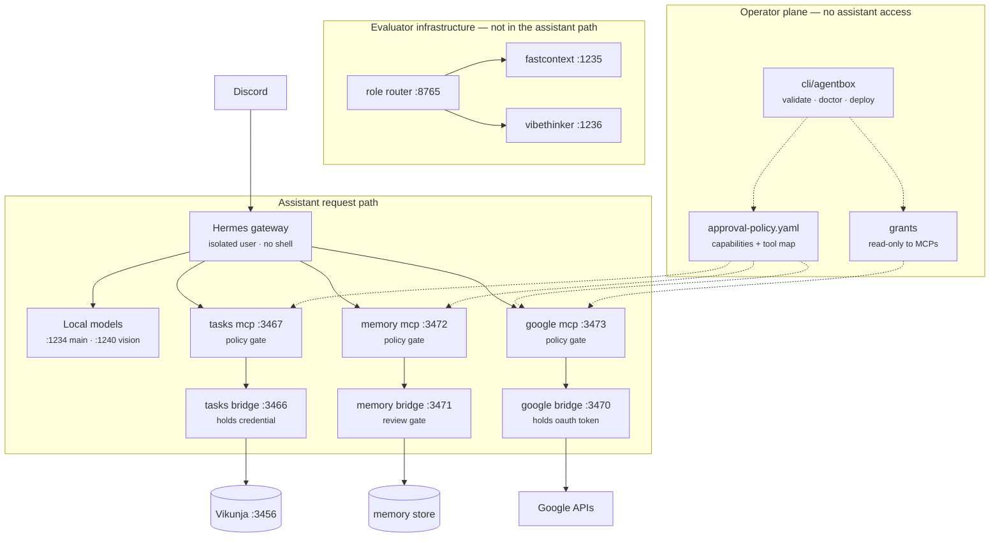

# Architecture

Agentbox is a self-hosted personal AI assistant platform for a single
operator on local hardware. The assistant (a Hermes-style gateway) never gets
raw shell access or raw credentials — it gets narrow, policy-gated levers.

Solid edges are the live request path. Dotted edges are configuration the
operator controls and the assistant cannot write. The role router and both
worker models are drawn separately because the gateway does not call them —
they serve the evaluator. Verified against the live gateway config and the
router's access log, 2026-08-02.

## Trust boundaries

**Tool results are untrusted input.** Anything a bridge returns may contain
text an outsider wrote — an email body is the obvious case. A small worker
model on this host (FastContext-4B, `:1235`) was measured obeying an
instruction embedded in tool data in 10 of 10 attempts on a memory-reconcile
task (n=10, single task type, measured in `agentbox-evals`). Treat that as the
default assumption for any model in the loop, not a quirk of one worker.

The practical consequence: **do not wire `/context/extract` into the assistant's
path for content that originated outside the account** without deciding what
happens when the extraction obeys the content instead of summarising it. Today
that path does not exist, which is the only reason this is a note rather than a
defect.

Where this is already contained, and why those choices were containment rather
than gating:

- calendar events refuse `attendees` and send `sendUpdates=none`, so an
  injected instruction cannot make the assistant email anyone;
- Gmail labels can only be applied from the `agentbox/` namespace, so an
  injected label id is refused;
- durable memory needs an operator token the assistant does not hold, so an
  injected "remember that…" reaches a review queue and stops;
- no tool sends mail or deletes anything, because those are not exposed.

A constraint holds when the model is compromised. An approval only helps if a
human reads carefully first.

## Design principles

- **Levers, not shell.** Every capability is an explicit endpoint with a
  contract, not terminal access.
- **Bridges hold credentials.** OAuth tokens and API secrets live inside
  bridge containers, injected at deploy time (1Password `op://` references or
  plain env files). The assistant and router never see them.
- **Deterministic routing.** Which worker handles which role is code
  (`router/agentbox_router.py`), not model judgment. Used by the evaluator.
- **Constrain rather than gate, where possible.** A constraint holds when the
  model is compromised; an approval only helps if a human reads carefully
  first. Several capabilities are `allowed` because the bridge contains them.
- **Deny by default.** Actions resolve against `policies/approval-policy.yaml`
  in tier order `always_denied` → `approval_required` → `allowed`; unknown
  actions require approval.
- **Local-only network posture.** Compose services bind to localhost or an
  explicit LAN IP; `cli/agentbox validate` rejects `0.0.0.0` bindings and
  unqualified port mappings.

## Components

| Dir | Role |
|---|---|
| `router/` | Stdlib-only role router + systemd user units for the two workers. Evaluator infrastructure; not called by the gateway |
| `gateway/` | Example gateway configuration (model aliases, MCP endpoints) |
| `policies/` | Machine-readable approval policy + human-readable mirrors |
| `services/compose/` | One directory per service: task backend (Vikunja) and bridge/MCP pairs for memory and Google Workspace |
| `cli/` | Operator CLI: `deploy`, `validate`, `doctor`, `status`, `policy check`, `grant`, `memory`, `scaffold` |
| `docs/` | This document and the runbook |

## Policy enforcement

One file, `policies/approval-policy.yaml`, covering both actors. Semantics:
`always_denied` → `approval_required` → `allowed`, unknown defaults to
`approval_required`.

- `tiers` names **capabilities** — what may be done, in language a human
  reviews (`host_package_install`, `email_state_change`, `merge_own_pr`).
- `tools` maps each assistant-visible MCP tool onto the capability it
  exercises, so a tool call resolves to the same tier as the equivalent
  operator action.

Enforced in two places against that one file: `cli/agentbox policy check` for
operator actions, and `policy_gate.py` in every MCP at the single `tool_call`
dispatch point for the assistant.

This was briefly two files, and they contradicted each other within hours —
`personal_data_access_beyond_task` and `gmail_label_management` were
`approval_required` in one while `search_gmail` and `add_gmail_labels` were
`allowed` in the other. A capability belongs in exactly one place; the tool map
is an index into it, not a second policy. `validate` fails on an unmapped tool
and on a drifted vendored copy.

`approval_required` tools need an operator grant (`cli/agentbox grant`), which
is time-boxed and single-use by default. See the runbook.

## Extension points

- **Builder sandbox** — implemented: `cli/agentbox scaffold <name>` generates a
  complete bridge from `services/templates/bridge`, runs `validate`, and commits
  it to a `scaffold/*` branch. It never deploys and never merges, because
  `merge_own_pr` is `always_denied` and a generated service that deployed itself
  would route around that.
- **Memory review gates** — implemented: the assistant proposes, an operator
  approves via `cli/agentbox memory` using a credential the assistant does not
  hold.
- **Cloud escalation** (not implemented): the intended pattern is
  escalate-on-failure (try the local model, escalate when validation fails),
  gated by the approval policy — not an LLM-based tier classifier.

## Reference deployment

AMD Strix Halo (Ryzen AI Max+ 395, Radeon 8060S iGPU, gfx1151, unified
memory) running Ubuntu Server with llama.cpp (Vulkan) serving a ~35B MoE
model at up to 200K context, plus two small worker models. Any machine that
can serve an OpenAI-compatible endpoint works; the router and CLI are
stdlib-only Python.
