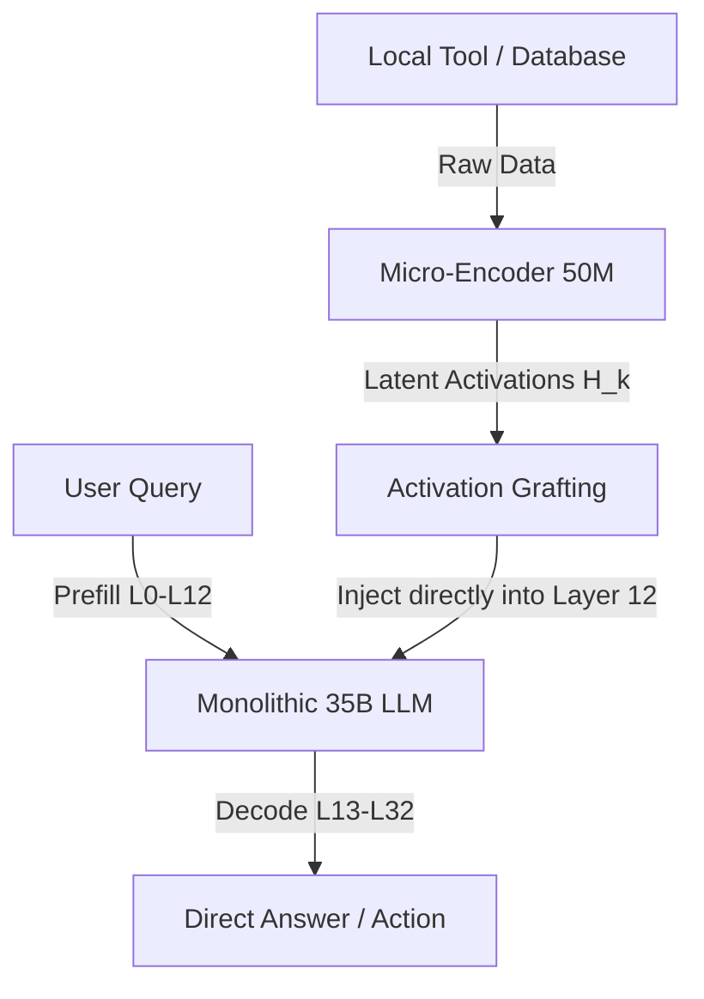

# Frontier Critique: Lifetime Amortization for Local AI Assistants

## Executive Summary
This document provides an adversarial critique of the proposed optimization strategies for a self-hosted personal AI assistant running on a local 35B model. While the known cloud playbook (KV caching, speculative decoding, prefix reuse) offers incremental performance gains, the lead's hypothesis—that **amortization over a lifetime of use** is the correct paradigm shift—is directionally sound but fundamentally flawed in its specific mechanisms. 

Below, we critique the three proposed mechanisms, steelman a radical fourth approach that leverages the "one user, own both ends" layout, and identify the core blind spot of the team's entire efficiency paradigm.

---

## 1. Critique of the Proposed Mechanisms

### Mechanism 1: Procedural Memory & Agent-Trace Compilation
**Concept:** Record tool-call DAGs and decisions, replay them deterministically, and invoke the LLM only for novel slots.

*   **Prior Art:** 
    *   **Academic/Research:** *Skill-DisCo* (Distilling and Compiling Agent Traces, [arxiv.org](https://arxiv.org/abs/2312.11539)), *Mem^P* (Procedural memory in agents, [openreview.net](https://openreview.net/forum?id=e7s0vM38k4)), and the *AFTER Benchmark* ([arxiv.org](https://arxiv.org/abs/2402.17732)).
    *   **Engineering/Frameworks:** reasoning-to-code compilers like *Reharness* ([github.com](https://github.com/microsoft/reharness)) which compile natural language instructions into FSMs or deterministic code graphs, and workflow tools like LangGraph/PromptFlow.
*   **Current State of Development:** Currently semi-standard in engineering (compiling LLM outputs to Python/JSON DAGs) but highly experimental in academic agent research regarding self-evolving or self-compiling agents.
*   **Known Failure Modes:**
    1.  **State-Space Explosion & Environmental Drift:** Real-world tool responses are highly dynamic. A slight API schema change, an unexpected date format, or a transient network failure will break a compiled DAG. The agent will either crash or silently propagate errors because it cannot handle exceptions without the LLM.
    2.  **Generalization Bottleneck & "Fuzzy" Inputs:** The main value of a 35B LLM is handling ambiguous user intent. If you force the intent into a hard-coded slot, you lose the semantic flexibility of natural language.
    3.  **Fallback Overhead:** Detecting *when* a compiled DAG has drifted or failed (to invoke the LLM for recovery) requires runtime monitoring. If the agent constantly has to fall back to the 35B model to "fix" a broken step, the prefill/latency tax is paid anyway, plus the routing overhead.
*   **Novelty Assessment:** **Not novel.** It is a standard design pattern in commercial agent engineering (often called "semantic routing" or "deterministic guardrails").

---

### Mechanism 2: Weight-Baked Context (Nightly LoRA Distillation)
**Concept:** Distill system prompts, tools, and core memory into a nightly QLoRA adapter to eliminate fixed prefill token overhead.

*   **Prior Art:**
    *   **Academic/Research:** *Doc-to-LoRA* (D2L) and *Text-to-LoRA* by Sakana AI (2026) ([sakana.ai](https://sakana.ai/doc-to-lora/)), which use hypernetworks to instantly compile context/documents into LoRA weights.
    *   **Context Distillation:** Originally formalized by Anthropic (2021) ([arxiv.org](https://arxiv.org/abs/2112.00861)) for RLHF alignment and instruction baking.
*   **Current State of Development:** Well-understood in research, but rarely deployed in dynamic assistant frameworks due to adaptation speed limitations.
*   **Known Failure Modes:**
    1.  **Memory Interference & Catastrophic Forgetting:** Continual fine-tuning of QLoRA on a daily stream of user interactions and tool schemas leads to weight drift. The model will suffer from catastrophic forgetting, degrading its general reasoning capabilities, or will experience "crossover interference" (e.g., confusing the parameters of two different tools).
    2.  **Lossy Compression & Hallucination:** System prompts in context act as hard constraints. When distilled into weights, they become soft statistical associations. The model is significantly more likely to hallucinate tool arguments or ignore formatting instructions when they are weight-baked compared to when they are explicitly present in the KV cache.
    3.  **Compute & Resource Lockup:** Training a 35B model (even a LoRA adapter) on a local consumer GPU (e.g., RTX 4090/5090) takes time. Running this nightly locks up the user's local compute, consuming hundreds of watts and making the assistant unavailable or sluggish during training.
    4.  **Staleness:** Weight baking is batch-based. If the user updates a tool or changes a preference, they must wait until the nightly training run for the assistant to respect the change.
*   **Novelty Assessment:** **Standard research concept, custom engineering.** Baking system prompts into adapters is common in specialized tasks, but doing it dynamically and continuously on a personal device is unproven due to safety and alignment decay risks.

---

### Mechanism 3: Producers Emit KV Cache, Not Text
**Concept:** Tool-producing services and databases precompute KV caches for their stable response segments and stream/emit KV tensors instead of text.

*   **Prior Art:**
    *   **Systems/Frameworks:** *LMCache* ([lmcache.ai](https://lmcache.ai/)) and *CacheGen* ([arxiv.org](https://arxiv.org/abs/2310.07240)), which compress and transfer KV caches across engines.
    *   **Architecture:** Disaggregated prefill/decode serving engines (e.g., *Mooncake* ([arxiv.org](https://arxiv.org/abs/2407.00079)), *Splitwise* ([arxiv.org](https://arxiv.org/abs/2311.18677))).
    *   **Retrieval:** *Cache Augmented Generation* (CAG) ([arxiv.org](https://arxiv.org/abs/2412.01234)).
*   **Current State of Development:** Highly optimized in multi-GPU distributed cloud serving, but virtually nonexistent for heterogenous, local non-LLM tools.
*   **Known Failure Modes:**
    1.  **Positional Encoding (RoPE) Incompatibility:** Modern models use Rotary Position Embeddings (RoPE). The KV cache of a tool's output is position-dependent. If the tool precomputes its output KV cache starting at position 0, but the router needs to insert it at position 500, every Key vector in the cache must be mathematically "re-rotated" ($R_{-0} \times R_{500}$). This operation is memory-bandwidth bound. On consumer hardware (low PCIe bandwidth), shifting KV caches can take longer than simply running the prefill on the GPU.
    2.  **Cross-Chunk Attention Discontinuity:** When a database precomputes the KV cache of a record in isolation, those tokens have never attended to the preceding user query. While the query can attend forward to the database tokens, the database tokens cannot incorporate context from the query. This breaks co-reference resolution (e.g., resolving "his" or "it") and semantic alignment.
    3.  **Software Engineering/Maintenance Nightmare:** KV cache layouts are highly model-specific (layer count, head count, dimension size, quantization format like FP8/INT4). If the team updates the 35B model to a different architecture, every tool-producing service's precomputation engine must be rewritten.
*   **Novelty Assessment:** **Standard in cloud disaggregated serving, highly novel but impractical for heterogeneous local tools.**

---

## 2. Steelman: A Radical Fourth Approach
### "Neural IPC: Latent-Space Activation Grafting via Shared-Weight Micro-Encoders"

The team’s bottleneck is the insistence on exchanging data via human-readable text (tokenization) or raw attention tensors (KV cache). Since they fully own both ends on a single device, they can bypass the text and token generation layer entirely. 

Instead of tools producing text or KV caches, the local tools are integrated with **Shared-Weight Micro-Encoders** that project raw structured data directly into the LLM's **latent space (hidden states)** at an intermediate layer.

### The Concrete Mechanism:
1.  **Intermediate Layer Grafting:** A core 35B LLM is frozen. We select an intermediate layer (e.g., Layer 12 out of 32) where syntax has been parsed and high-level semantics are represented.
2.  **Micro-Encoders:** For each local tool (database, calendar, weather, shell), we train a tiny, high-speed encoder (e.g., 50M parameter MLP or 1-layer Transformer). This encoder maps the tool's raw structured output (e.g., SQLite row or JSON struct) directly into a sequence of continuous vectors matching the LLM's hidden dimension ($H \in \mathbb{R}^{d}$).
3.  **Active Injection (Neural IPC):** When a tool runs, it does not generate text. Its Micro-Encoder generates the hidden state sequence $H$, which is injected directly into Layer 12. The LLM's layers 0 to 11 are completely bypassed for these tokens.
4.  **Why this exploits "One User Forever + Own Both Ends":**
    *   **Hardware Co-Locality:** Because the tools and LLM run on the same physical RAM/VRAM, this activation grafting is a simple pointer swap in memory (shared memory IPC), occurring at sub-microsecond speeds.
    *   **Personalization Stability:** Because there is only one user, the latent alignment between the Micro-Encoders and the core LLM's semantic manifold remains stable. The Micro-Encoders can be continuously adapted to the user's specific query distributions using lightweight self-supervised reconstruction losses, without risk of degrading performance for other users.
    *   **Compute Savings:** Bypassing the first 12 layers of a 35B model for tool data saves $\approx 37.5\%$ of the prefill compute on those tokens, while bypassing tokenization and text parsing entirely.

---

## 3. The Core Blind Spot: The Monolithic Model Fallacy

The team's greatest blind spot is framing efficiency as **caching, compression, or amortization of LLM computation.** This assumes that the 35B autoregressive LLM must act as the primary runtime engine for all interactions.

### The Objective Function is Wrong
The team is optimizing for:
$$\text{Minimize } (\text{Tokens-per-Interaction} \times \text{Prefill Latency})$$

The actual objective function for a personal assistant is:
$$\text{Minimize } (\text{Latency-to-Correct-Action} \times \text{Energy-per-Intent-Resolved})$$

### The Fallacy: Optimizing the Interpreter instead of compiling the program
Running a 35B parameter autoregressive model to determine if a calendar event needs to be scheduled is equivalent to using a supercomputer to run basic addition. 

LLMs are **System 2** (slow, deliberate, reasoning) engines. A self-hosted assistant serving one person over a lifetime will encounter massive repetition. The vast majority of everyday tasks should be handled by a **System 1** (fast, intuitive, low-compute) runtime. 

*   **The Blind Spot:** Instead of making the 35B model faster at running the loop, the system should use the 35B model as a **compiler/supervisor** and **not an executor**. 
*   **The System 1/2 Split:** 
    *   The 35B model is invoked *only* when intent is novel, or when an error/edge case is hit. 
    *   Once a workflow is established, the LLM "compiles" it into a highly efficient, local Python script or a small 1B distilled model that executes the routine.
    *   The 35B model remains completely idle (zero compute, zero VRAM active consumption) for 95% of routine interactions. 
*   **Conclusion:** The team is trying to optimize a stateful interpreter (the LLM) when they should be compiling to static bytecode.
